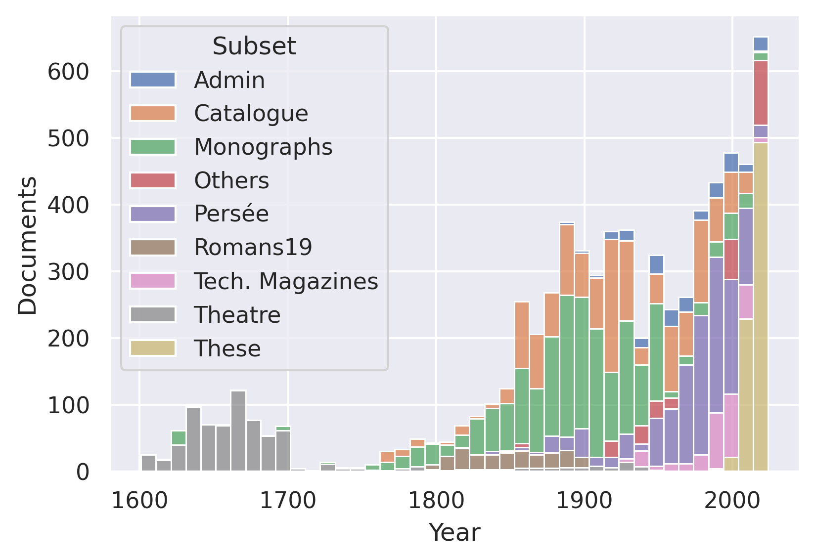

# Layout Analysis Dataset with SegmOnto (LADaS)

LADaS, created by the [ALMANaCH team-project](https://almanach.inria.fr/index-en.html) at Inria, is a 
multidocuments diachronic layout analysis dataset. This dataset includes:

- Monographs from the Bibliothèque Nationale de France (17th century - today);
- PhD Thesis, in various fields (not only STEM, 20th-21st century);
- Selling Catalogs (for manuscripts and art pieces), in various fields (18th-20th century);
- Noisy digitization (with fingers for example, 20th-21st century);
- Academic papers (mostly Humanities and Social Sciences) (19th-21st century);
- Misc stuff found here and there.

The data are in YoloV8 txt format (class center_x center_y width height).

The script in document is mostly Latin script, and language is mostly French with some representation of the main
western academic languages.

### Annotation

Label Annotation have been conducted using the [SegmOnto](https://segmonto.github.io/) vocabulary. 
An annotation guide is available [here](AnnotationGuide.md).

### More details about some subsets

*Last update of the plot: 15/12/2023*

## Structure

The data can be found in `./data`. Each subset is present in its own subset folder if you want to train cross-genre.

A script, `unify.sh` allows for having a single directory with train/dev/test folders for Roboflow training.

## Licence

## Citation

See the CITATION.CFF file

## Contact

Thibault Clérice ( th[a-z]+.cle[a-z]+ [at] inria.fr)